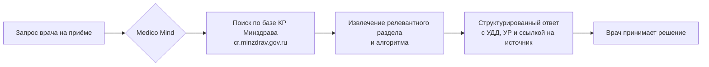

## ИИ-ассистент для врача: как Medico Mind помогает на приёме — 5 реальных сценариев

Врач на типичном приёме принимает десятки клинических решений в час. Нужно сверить актуальную версию клинических рекомендаций (КР), вспомнить критерии второй линии терапии при ХБП, интерпретировать пограничные анализы — и всё это между разговором с пациентом и заполнением медицинской документации.

**Medico Mind** — ИИ-помощник врача, работающий исключительно на базе официальных КР Министерства здравоохранения РФ с портала [cr.minzdrav.gov.ru](https://cr.minzdrav.gov.ru/). Каждый ответ содержит код КР, уровень доказательности (УДД), класс рекомендации (УР) и прямую ссылку на источник.

Ниже — пять сценариев, в которых нейросеть для врачей работает прямо на приёме.

---

### Сценарий 1. Подбор терапии по клиническим рекомендациям

**Ситуация:** Пациент 58 лет, артериальная гипертензия 2-й степени, очень высокий сердечно-сосудистый риск, сопутствующий СД 2 типа, ХБП С3а с альбуминурией. Какую комбинацию антигипертензивных препаратов назначить?

**Без ИИ:** Врач открывает КР «Артериальная гипертензия у взрослых» (код 62) на cr.minzdrav.gov.ru, листает 120-страничный PDF, ищет таблицу особых клинических ситуаций.

**С Medico Mind:** Запрос в одну строку — ответ за 5 секунд.

> **Ответ ассистента:**
> При наличии СД 2 типа и ХБП с альбуминурией препаратами первого выбора являются **ИАПФ или БРА** (УДД 1а, УР А). Рекомендуемая стартовая комбинация: **ИАПФ/БРА + антагонист кальция** или **ИАПФ/БРА + тиазидоподобный диуретик**. При АГ 2–3-й степени — немедленное начало комбинированной терапии (УДД 1а, УР А). ББ — только при дополнительных показаниях (ИБС, тахиаритмия, ФП). Целевой АД: <130/80 мм рт. ст. при хорошей переносимости.
> *Источник: КР «Артериальная гипертензия у взрослых», код 62, cr.minzdrav.gov.ru*

**Что важно:** Ассистент не просто называет класс препаратов — он объясняет, почему в данной клинической ситуации именно эта комбинация является приоритетной, и подкрепляет ответ уровнями доказательности.

---

### Сценарий 2. Расшифровка лабораторных анализов

**Ситуация:** Пациентка 32 лет, жалобы на слабость и одышку при нагрузке. ОАК: Hb — 98 г/л, MCV — 74 фл, MCH снижен, ферритин — 8 нг/мл, СРБ — 2 мг/л, сывороточное железо снижено, ОЖСС повышена.

**С Medico Mind:** Врач вводит показатели — ассистент интерпретирует сочетание в контексте КР.

> **Ответ ассистента:**
> Лабораторная картина соответствует **железодефицитной анемии** (МКБ-10: D50): гипохромная микроцитарная анемия с ферритином < 12 нг/мл. СРБ в норме — анемия хронических заболеваний (АХЗ) маловероятна (при АХЗ ферритин нормальный или повышен). По КР «Железодефицитная анемия» (код 669, Минздрав РФ): показана пероральная ферротерапия препаратами Fe²⁺ в сочетании с аскорбиновой кислотой (УДД 1а, УР А). Контроль ферритина и Hb — через 4–8 недель. **Обязательно:** установить источник кровопотери (гинекологический анамнез, ФЭГДС при необходимости).
> *Источник: КР «Железодефицитная анемия», код 669, cr.minzdrav.gov.ru*

**Что важно:** Ассистент не просто ставит диагноз по снижению гемоглобина — он проводит дифференцировку с АХЗ через СРБ и ферритин, задаёт следующий диагностический шаг.

---

### Сценарий 3. Дифференциальная диагностика

**Ситуация:** Пациент 45 лет. Внезапная одышка, боль в грудной клетке «на вдохе», тахикардия 108 уд/мин. ЭКГ: паттерн S1Q3T3. Д-димер — значительно повышен. Тропонин под вопросом. Нужен алгоритм дифдиагностики.

**Без ИИ:** Врач перебирает нозологии по памяти, параллельно пытается вспомнить порядок действий из нескольких КР.

**С Medico Mind:** Приоритизированный алгоритм исключения — за 8 секунд.

> **Ответ ассистента:**
> Клиническая картина в первую очередь подозрительна на **ТЭЛА** (МКБ-10: I26). Алгоритм исключения по КР Минздрава РФ:
>
> **1. ТЭЛА (приоритет №1):** Одышка + плевральная боль + тахикардия + повышенный Д-димер → **КТ-ангиография лёгочных артерий** (золотой стандарт). ЭхоКГ: дилатация правого желудочка. При высокой клинической вероятности — антикоагуляция до верификации диагноза.
>
> **2. ОКСбпST (исключить параллельно):** Тропонин высокочувствительный — при повышении >99-го перцентиля + динамика → ИМбпST. Источник: КР «ОКСбпST», код 154.
>
> **3. Расслоение аорты:** Проверить асимметрию АД на руках, характер боли (миграция, «разрывной» характер) → КТ-ангиография аорты.
>
> **4. Спонтанный пневмоторакс:** Аускультация + рентгенография ОГК (отсутствие лёгочного рисунка на стороне поражения).
> *Источники: КР по ТЭЛА (МКБ I26), КР «ОКСбпST» код 154, КР «ИМпST» код 157, cr.minzdrav.gov.ru*

**Что важно:** При ургентном состоянии структурированный алгоритм с приоритетами критически сокращает время до правильного диагноза.

---

### Сценарий 4. Обоснование медицинской помощи для страховой компании

**Ситуация:** Страховая медицинская организация запрашивает обоснование назначения комбинированной антигипертензивной терапии с первого визита — вместо «стандартной» монотерапии с поэтапной интенсификацией.

**Без ИИ:** Врач тратит 20–30 минут на поиск нужного абзаца в КР и формулирование письменного ответа.

**С Medico Mind:** Готовая цитата с разделом, кодом и уровнем доказательности.

> **Ответ ассистента:**
> Согласно КР «Артериальная гипертензия у взрослых» (код 62, Минздрав РФ), раздел «Медикаментозное лечение», критерии качества медицинской помощи:
>
> *«При АГ 2–3-й степени или очень высоком сердечно-сосудистом риске рекомендовано немедленное начало комбинированной антигипертензивной терапии»* (УДД 1а, УР А).
>
> Назначение монотерапии в данном случае **не соответствует** действующим клиническим рекомендациям и критериям качества медицинской помощи. Для письменного ответа в СМО рекомендуется сослаться на: cr.minzdrav.gov.ru, КР код 62, раздел «Медикаментозное лечение», таблица рациональных комбинаций.

**Что важно:** Точная цитата + код КР + ссылка на конкретный раздел = полноценный ответ на запрос страховщика, защищающий позицию врача.

---

### Сценарий 5. Быстрый поиск по клиническим рекомендациям

**Ситуация:** Терапевт впервые ведёт пациента с СД 2 типа, осложнённым хронической сердечной недостаточностью (ХСН). Нужно найти актуальную КР и понять, какой сахароснижающий препарат является приоритетным в данной клинической ситуации.

**Без ИИ:** Поиск на cr.minzdrav.gov.ru по МКБ E11, навигация по PDF КР «СД 2 типа» (290 страниц), поиск раздела по коморбидности с ХСН — ~10–15 минут.

**С Medico Mind:** Целевой ответ — за 10 секунд.

> **Ответ ассистента:**
> По КР «Сахарный диабет 2 типа у взрослых» (код 290, Минздрав РФ), раздел «Интенсификация терапии»:
>
> При наличии **хронической сердечной недостаточности** препаратами выбора (дополнительно к метформину) являются **ингибиторы НГЛТ-2**: дапаглифлозин и эмпаглифлозин (УДД 1а, УР А). Доказано снижение риска госпитализации по поводу ХСН и сердечно-сосудистой смертности.
>
> **Не предпочтительны при ХСН:** иДПП-4 (в частности, саксаглиптин — увеличение риска госпитализации по ХСН), препараты сульфонилмочевины.
>
> Метформин — сохранить при СКФ ≥ 30 мл/мин/1,73 м².
> *Источник: КР «Сахарный диабет 2 типа у взрослых», код 290, cr.minzdrav.gov.ru*

**Что важно:** Ассистент не только находит нужный документ, но и сразу извлекает клинически значимый ответ с указанием того, чего делать *не следует* — что особенно ценно при коморбидном пациенте.

---

### Как Medico Mind работает с клиническими рекомендациями

Ассистент работает **исключительно** с официальными клиническими рекомендациями Министерства здравоохранения РФ, опубликованными на портале [cr.minzdrav.gov.ru](https://cr.minzdrav.gov.ru/).

Каждый ответ включает:

| Элемент | Пример |
|---|---|
| Код КР и нозология | КР код 62, «Артериальная гипертензия у взрослых» |
| МКБ-10 | I10–I15 |
| Уровень доказательности (УДД) | УДД 1а (систематический обзор РКИ) |
| Класс рекомендации (УР) | УР А (высокий) |
| Раздел документа | «Медикаментозное лечение», таблица комбинаций |
| Прямая ссылка | cr.minzdrav.gov.ru |

---

### Для каких специальностей

Medico Mind актуален для любого врача, работающего с КР Минздрава:

- **Терапевты и ВОП** — коморбидные пациенты, подбор терапии, диспансерное наблюдение
- **Кардиологи** — АГ, ХСН, ОКС, антикоагулянты
- **Эндокринологи** — СД 2 типа, алгоритмы интенсификации
- **Гематологи и гинекологи** — анемии, ферротерапия
- **Врачи скорой помощи** — ургентные состояния, дифдиагностика
- **Страховые эксперты и главные врачи** — экспертиза качества медицинской помощи

---

### Попробуйте Medico Mind прямо сейчас

**3 запроса — бесплатно.** Без регистрации. Задайте ассистенту любой клинический вопрос по КР Минздрава и убедитесь, что нейросеть для врачей действительно работает на приёме.

**[Попробовать бесплатно →](#)**

---

*Medico Mind — ИИ-помощник врача на основе официальных клинических рекомендаций Министерства здравоохранения РФ ([cr.minzdrav.gov.ru](https://cr.minzdrav.gov.ru/)). Не заменяет клиническое мышление специалиста. Все решения принимаются лечащим врачом.*
